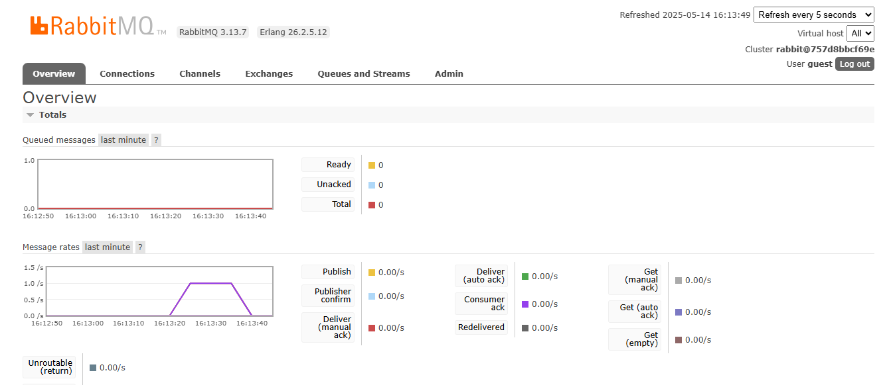
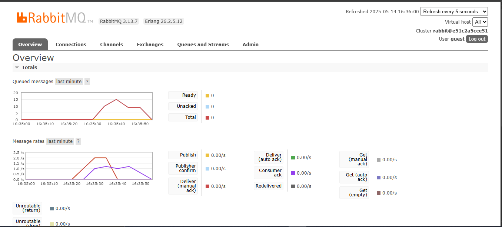
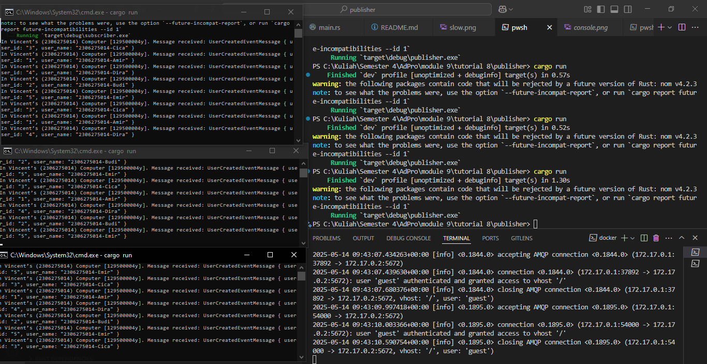
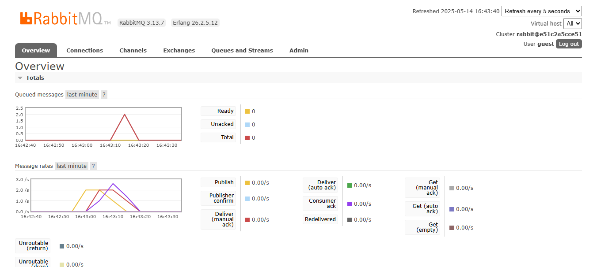

## a. How much data your publisher program will send to the message broker in one run?

In one execution, the publisher serializes and sends five `UserCreatedEventMessage` payloads. Each payload contains two UTF-8 strings (`user_id` and `user_name`) plus Borsh’s length-prefix overhead. Assuming an average of 1–5 bytes for the ID and around 20 bytes for the name, each serialized message is roughly 30–40 bytes. Multiplied by five messages, the raw payload data is approximately 150–200 bytes per run. With AMQP framing and protocol headers added, you’ll see closer to 300 bytes total transmitted.

## b. The URL `guest:guest@localhost:5672` is the same as in the subscriber program—what does it mean?

The URI `guest:guest@localhost:5672` tells both publisher and subscriber to connect to the same RabbitMQ broker. The first `guest` is the username and the second `guest` is its password. `localhost` indicates the broker is running on the same machine as your application. Port `5672` is the default AMQP port for client connections. Using this identical URI ensures both sides authenticate and communicate with the exact same broker instance.

## Bukti RabbitMQ

## Consoles

Pada jendela kiri terlihat konsol subscriber yang terus-menerus menerima lima event `UserCreatedEventMessage` dari publisher. Setiap event ditampilkan dengan format debug Rust, misalnya `UserCreatedEventMessage { user_id: "1", user_name: "2306275014-Amir" }`. Setelah mencetak kelima event, konsol tetap aktif menunggu event berikutnya. Di jendela kanan tampak log RabbitMQ broker yang menampilkan serangkaian koneksi AMQP. Terjadi serangkaian koneksi dan otentikasi oleh user `guest`, diikuti dengan penutupan koneksi setelah event diproses. Ini membuktikan bahwa publisher berhasil mengirim lima pesan dalam satu kali `cargo run`, sedangkan subscriber memprosesnya dan broker mencatat aktivitas koneksi sesuai urutan.

## Monitoring Chart Based on Publisher

In the screenshot above, the RabbitMQ “Publish” rate chart shows three distinct spikes because the publisher was run three times consecutively. Each purple peak corresponds to the burst of five messages sent in a single `cargo run`. At the same time, the “Deliver (auto ack)” metric registers matching spikes, indicating immediate delivery to the subscriber. Between runs, both publish and deliver rates drop back to zero since no new events are being published. This pattern confirms that each execution triggers a fixed batch of events and allows you to visually monitor the throughput and timing of your publisher. By watching these spikes, you can verify that the publisher is successfully connecting and dispatching messages to RabbitMQ.

## Simulating Slow Subscriber and Queue Backlog

In this screenshot, the “Queued messages” chart peaks at 15 after running the publisher five times consecutively with only one subscriber. Each publisher run adds five messages to the queue, totaling 25 published events. Because the subscriber enforces a 1-second delay per message, it had only consumed 10 messages by that point (25 published − 10 processed = 15 remaining). As a result, RabbitMQ’s backlog rises to 15 before the consumer catches up. Over time, you can observe the red line declining as the subscriber gradually processes the queued messages. This scenario highlights how a single, slow consumer can lead to significant message accumulation when the producer is faster.

## Reflection on Running Multiple Subscribers

With three subscriber instances connected to the same queue, message processing is distributed almost evenly among them. In my captures, you can see one console handling “Budi” and “Dira”, another handling “Amir” and “Cica”, and the third picking up “Emir” and the remaining messages. As a result, the RabbitMQ backlog clears much faster compared to a single slow consumer. This demonstrates how horizontal scaling of consumers in an event-driven architecture can improve throughput and reduce queue build-up. To further optimize, we could adjust the consumer prefetch/QoS settings or even implement asynchronous handlers within each subscriber process. Additionally, centralizing error handling and reconnect logic would make the system more resilient under heavy load.