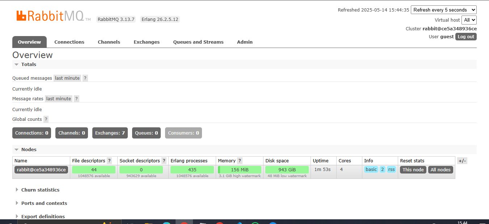
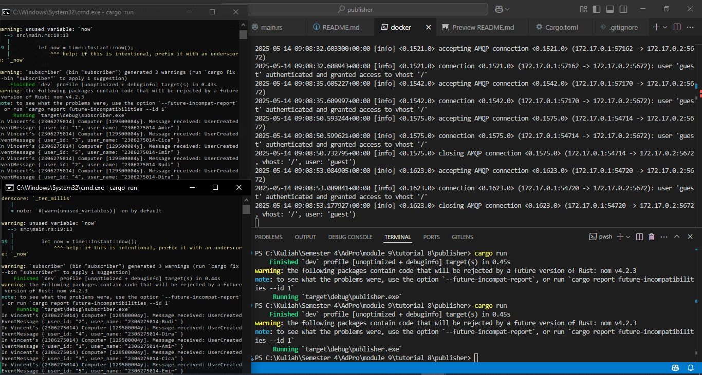

## a. How much data your publisher program will send to the message broker in one run?

In one execution, the publisher serializes and sends five `UserCreatedEventMessage` payloads. Each payload contains two UTF-8 strings (`user_id` and `user_name`) plus Borsh’s length-prefix overhead. Assuming an average of 1–5 bytes for the ID and around 20 bytes for the name, each serialized message is roughly 30–40 bytes. Multiplied by five messages, the raw payload data is approximately 150–200 bytes per run. With AMQP framing and protocol headers added, you’ll see closer to 300 bytes total transmitted.

## b. The URL `guest:guest@localhost:5672` is the same as in the subscriber program—what does it mean?

The URI `guest:guest@localhost:5672` tells both publisher and subscriber to connect to the same RabbitMQ broker. The first `guest` is the username and the second `guest` is its password. `localhost` indicates the broker is running on the same machine as your application. Port `5672` is the default AMQP port for client connections. Using this identical URI ensures both sides authenticate and communicate with the exact same broker instance.

## Bukti RabbitMQ

## Consoles

Pada jendela kiri terlihat konsol subscriber yang terus-menerus menerima lima event `UserCreatedEventMessage` dari publisher. Setiap event ditampilkan dengan format debug Rust, misalnya `UserCreatedEventMessage { user_id: "1", user_name: "2306275014-Amir" }`. Setelah mencetak kelima event, konsol tetap aktif menunggu event berikutnya. Di jendela kanan tampak log RabbitMQ broker yang menampilkan serangkaian koneksi AMQP. Terjadi serangkaian koneksi dan otentikasi oleh user `guest`, diikuti dengan penutupan koneksi setelah event diproses. Ini membuktikan bahwa publisher berhasil mengirim lima pesan dalam satu kali `cargo run`, sedangkan subscriber memprosesnya dan broker mencatat aktivitas koneksi sesuai urutan.